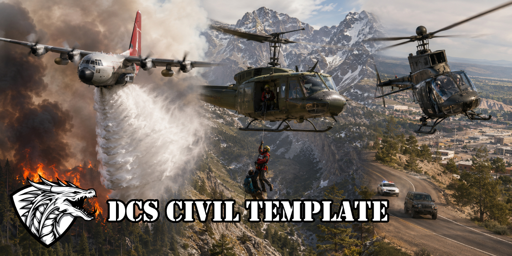

# DCS Civil Mission Template

Modular template for civil missions in DCS World: firefighting, mountain/sea
SAR, MedEvac, battlefield CASEVAC, police (chase and SWAT), tiered cargo
transport. All in **pure native Lua** (no MIST/MOOSE/CTLD).




## Repository layout

```
Scripts/
  01_CivilCore.lua          Config + shared systems: mission scanner (zones,
                            polygon support, templates, ships), point pools,
                            player registry, hover trigger, airdrop tracking,
                            scoring, scenery kits, event director, admin menu
  10_CivilFirefighting.lua  Fires (severity 1-10), fire brigade trucks,
                            helicopter water ops, C-130 retardant + spotter
  20_CivilRescue.lua        SAR Mountain/Sea, MedEvac, CASEVAC, SAR vessels,
                            hospital ships (shared rescue engine)
  30_CivilPolice.lua        Police chase (pressure mechanic) + SWAT fast-rope
  40_CivilTransport.lua     Fixed mass tiers + supply airdrops
  45_CivilAviation.lua      Infrastructure recon, VIP shuttle, media coverage
  50_CivilCommand.lua       Command center marker commands + session recap
dist/
  CivilMissionTemplate.lua  Single-file build; regenerate with tools/build.sh
tools/build.sh              Concatenates Scripts/ into the single-file build
tools/leaderboard.py        Cross-session leaderboard from dcs.log SCORE lines
docs/
  CONCEPT.md                Design brief (decisions and verifications)
  FEASIBILITY.md            Point-by-point feasibility check
  ME_SETUP_GUIDE.md         Extended Mission Editor guide
  PILOT_BRIEFING.txt        Ready-to-paste mission briefing for the players
  GAME_MASTER_GUIDE.md      Handbook for the command center player
```

## Quick start

1. Add **CJTF Blue** to the blue coalition (all scripted spawns run under it).
2. Create the trigger zones from the checklist below.
3. Load `dist/CivilMissionTemplate.lua` with a single `DO SCRIPT FILE` action
   at MISSION START. If you load the `Scripts/` files individually instead,
   ORDER MATTERS: DCS runs `DO SCRIPT FILE` actions top to bottom, so add
   them in ascending numeric order. The prefixes ARE the load order: `01`
   first (everything depends on it), `50` last (it looks into every other
   module). Modules you do not use can be skipped, the rest adapts.
4. In game: `F10 -> Civil Missions` (the `Admin (test)` submenu starts any
   event manually).

## Mission Editor checklist: trigger zones

Matching is **by name prefix**: any zone whose name *starts with* the prefix
belongs to that pool (`CIVIL Fire Point Alpha`, `CIVIL Fire Point 12`, ...).
No numbering rules. Zones can be **circular or polygon (quad)**. Modules
whose zones are missing are skipped gracefully: place only what you test.

This applies to the MACRO-AREAS too: every name below is a prefix, so you
can have several regions of the same type (`CIVIL Fire Region North` and
`CIVIL Fire Region South`, two separate `CIVIL SAR Mountain Region ...`
mountains, more than one reload apron, cargo destination or SWAT base).
Events use whichever matching area contains or is nearest to them, and
rescue reports name the specific region.

| Zone name / prefix | Module | Qty | Placement |
|---|---|---|---|
| `CIVIL Fire Region ...` | Firefighting | 1+ | macro-region(s) containing the fire points; enable the spotter role and the C-130 line drop |
| `CIVIL Fire Point ...` | Firefighting | 3+ | curated ignition points: forest/fields, clear of buildings and roads |
| `CIVIL Fire Station ...` | Firefighting | 1+ | fire brigade depots; trucks depart from the nearest one and drive "On Road" to the fire |
| `CIVIL Water Point ...` | Firefighting | 1+ | helicopter water pickup, on a body of water with hover room |
| `CIVIL C130 Reload ...` | Firefighting | 1+ | retardant reload apron, reachable by taxi. **User-built static area**: decorate it yourself (auto-dressing off by default) |
| `CIVIL SAR Mountain Region ...` | Rescue | 1+ | macro-region(s) for mountain SAR (spotter + vague-direction reference); two separate mountains = two zones |
| `CIVIL SAR Mountain Point ...` | Rescue | 3+ | survivor spots reachable in a hover |
| `CIVIL SAR Sea Region ...` | Rescue | 1+ | macro-region(s) for sea SAR |
| `CIVIL SAR Sea Point ...` | Rescue | 3+ | on OPEN water (a boat spawns there) |
| `CIVIL Vessel Spawn ...` | Rescue | 1+ | rescue-boat harbors, on water. Balance rule: distance to the SAR points / 9 m/s should be slightly LONGER than the hover window (default 25 min ~ 13.5 km) |
| `CIVIL Medevac Point ...` | Rescue | 3+ | civilian casualty LZs (accidents, unsafe areas) |
| `CIVIL Casevac Point ...` | Rescue | 3+ | battlefield extraction LZs. **User-built static areas**: dress them with your own battlefield assets |
| `CIVIL Hospital ...` | Rescue | 1+ | on the actual hospital pads; delivery is ZONE-detected (still + low for 15 s), no FARP object needed. Auto-dressed with the medical-camp kit (`autoDress.hospitals = false` to disable) |
| `CIVIL Police Point ...` | Police | 30-40 | ON real city crossroads, neighbor distance <= 1500 m (chase random walk) |
| `CIVIL SWAT Base ...` | Police | 1+ | apron(s) where the helicopter can land to board the team |
| `CIVIL SWAT Point ...` | Police | 3+ | rooftops / urban LZs (rooftop infantry spawn TO TEST) |
| `CIVIL Cargo Point ...` | Transport | 3+ | loading points on flat ground |
| `CIVIL Cargo Destination ...` | Transport | 1+ | delivery zone(s): sling loads and supply airdrops count in any of them |
| `CIVIL Recon Point ...` | Aviation | 5+ | along a power line or pipeline; anomalies spawn on them, patrol the corridor low |
| `CIVIL VIP Pad ...` | Aviation | 2+ | passenger shuttle helipads (pickup and destination are drawn from this pool) |

## Mission Editor checklist: units (matched by name prefix)

**Ships (regular units):**

| Prefix | Matched on | Role |
|---|---|---|
| `CIVIL Rescue Vessel ...` | group name | steams to the approximate search area on sea SAR; a vessel holding 200 m / 60 s from the subject completes a SEA RESCUE credited to the identifying spotter |
| `CIVIL Hospital Ship ...` | unit name | mobile delivery pad (detection relative to the ship: works underway; deck landing with big-ship mods TO TEST) + mother ship launching rescue boats when closer than the harbors (e.g. Perry, Tarawa) |

**Late-activated spawn templates (optional: hardcoded fallback types are
used when absent):**

| Group prefix | Spawned as | Fallback type |
|---|---|---|
| `CIVIL Survivor ...` | mountain SAR / MedEvac subject | `Soldier M4` |
| `CIVIL Casualty ...` | battlefield CASEVAC casualty | `Soldier M4` |
| `CIVIL Boat ...` | sea SAR target | `ZWEZDNY` |
| `CIVIL Vessel ...` | spawned rescue boat | `speedboat` |
| `CIVIL SWAT Team ...` | SWAT squad | `Soldier M4` |
| `CIVIL Fugitive ...` | police chase car | `LandRover_ah` |
| `CIVIL Fire Truck ...` | fire brigade truck | `HEMTT TFFT` |
| `CIVIL Scene Rescue ...` | MedEvac scene: ambulance + medics | none (scene skipped) |
| `CIVIL Scene Accident ...` | MedEvac scene: crashed cars, bystanders | none (scene skipped) |
| `CIVIL Scene Battlefield ...` | CASEVAC scene: battlefield props | none (scene skipped) |
| `CIVIL Scene Camp ...` | mountain SAR scene: tent, second hiker | none (scene skipped) |
| `CIVIL Scene Crash ...` | mountain SAR scene: aircraft wreck | none (scene skipped) |
| `CIVIL Scene Sea ...` | sea SAR scene, built as a SHIP group | none (scene skipped) |
| `CIVIL Scene Robbery ...` | chase start scene: police cars, crowd | none (scene skipped) |
| `CIVIL Scene Standoff ...` | SWAT objective scene: cordon, cars | none (scene skipped) |
| `CIVIL Anomaly ...` | recon corridor anomaly visual | none (logical anomaly) |
| `CIVIL VIP ...` | waiting passenger visual | none (logical passenger) |

**Building a template**: create a group of the right category (ground or
ship), name the GROUP with the prefix, tick LATE ACTIVATION, place it
anywhere (position is irrelevant: the clone is re-centered on the event
point, keeping the relative layout and each unit's heading, types,
liveries and skill). No zone needed. `dcs.log` lists every template found
at mission start. Full step-by-step recipe in `docs/ME_SETUP_GUIDE.md`.

**Variety through multiple templates**: place as many groups as you want
with the same prefix and each spawn picks ONE of them at random. For
example `CIVIL Boat 1`, `CIVIL Boat 2`, `CIVIL Boat 3` (or `CIVIL Fugitive
BMW`, `CIVIL Fugitive Van`: any suffix works, numbering is optional) and
every event comes out with a different boat or car. The list builds itself
at mission start, no config to touch.

**Event scenes**: rescue events, the chase start and the SWAT objective all
spawn a scene next to the action. The scenario first picks a scene TYPE at
random from its list (`rescue.scenes.byScenario`, `police.sceneTemplates`,
`swat.sceneTemplates`), then a random variant among the templates sharing
that prefix. Build each scene as one group in the ME (an ambulance plus two
medics, wrecked cars, a police cordon; the sea scene as a ship group). When
the event ends the scene stays on for `rescue.scenes.despawnDelay` (default
5 minutes), then it is cleared. Missing templates simply spawn no scene.

**Subject signal, day and night**: the F10 command asks the subject to mark
its position. By day it pops orange smoke; by night (mission local time,
`rescue.signal` hours) smoke would be invisible, so the subject fires a
sequence of green signal flares instead. Works the same for every rescue
variant: mountain, sea, MedEvac and CASEVAC.

**Night illumination assist**: a second F10 command, night only, pops an
illumination flare 300 m over the nearest active objective (fire, SWAT
objective, cargo pickup, fleeing vehicle) and reports its bearing and
range. Rescue subjects not yet identified by a spotter get the flare over
the APPROXIMATE search area, so the intel model stays intact. Per-player
cooldown, tunable in `nightAssist`.

**Aviation tasks**: infrastructure recon (fly the corridor low, spot the
anomaly, report it via F10 before it expires), VIP shuttle (board a
passenger at one pad, deliver to another; ride comfort is the score:
acceleration spikes cost you the tip) and passive media coverage (hold in
the 1-3 km filming ring around any active event for 5 minutes and the
story airs).

**Light fixed-wing (Bronco, MB-339, L-39, C-101, Yak-52, Christen
Eagle...)** have a full job list: spotting works from ANY airplane (fire
intel relay plus rescue identification, which pays spotter points), the
recon corridor and the media ring suit them natively, and VIP pads placed
on airfield aprons give them an air-taxi role. On fires they fly the AIR
ATTACK role, like the real lead planes: they cannot haul retardant (the
reload refuses their types), instead their F10 command smoke-marks the
nearest fire from below 600 m. While the mark is hot (5 min), every drop
on that fire scores +25%, and the marker earns the assist when the fire
goes out. Types in `fire.airAttack`, TO VALIDATE per mod. A situation recap broadcasts every 30
minutes, final standings at mission end; `tools/leaderboard.py` turns the
logged SCORE lines into a cross-session ranking.

**Fire kinds**: each ignition rolls what is burning (`fire.kinds`): a
forest fire (flames), a landfill fire (thick dark smoke, slow growth) or an
industrial fire (fast growth). The report and the F10 mark name the kind,
so players can tell from afar what they are heading into.

## The severity scale (1-10, all events)

Every event rolls a **severity 1-10** at spawn: one roll from which all its
parameters derive, announced in every report ("MedEvac severity 8"):

| Event | Severity drives |
|---|---|
| Wildfire | LIVE variable: grows on a per-fire cadence, spreads visually (1 effect -> cluster, capped at 5 for performance), suppressed by drops/trucks, 0 = out |
| SAR / MedEvac / CASEVAC | criticality deadline (severity 10 = -40%), hover window (less time) and required hover time (more), score |
| Police chase | car speed, pressure build/decay rates, two-vehicle convoy at severity >= 8, score |
| SWAT | operators required (4->8), squad boarded at the base is sized for the worst active scenario, resolve time, score |
| Transport ("priority") | time to live of the load (priority 10 expires in 45 min) and score |

Score multiplier is anchored at `0.7 + 0.06 * severity`: severity 5 = x1.0.

## Command center (game master)

A player in a **Game Master / Tactical Commander slot** (full F10 map, SRS;
native asset control with Combined Arms) acts as the emergency command
center by placing **F10 map markers** whose text starts with `civil`: the
commands work from any slot and the marker position IS the target position.

Worked examples (place the marker where you want the effect, type the text,
the marker is consumed once executed):

```
civil director off        take the wheel: automatic generation pauses
civil fire 8              severity-8 wildfire right under the marker
civil medevac 9           critical casualty there (~18 min of criticality)
civil sars 6              castaway on that water position (vessels react)
civil casevac             battlefield casualty, severity rolled randomly
civil swat 7              SWAT objective there (needs ~7 operators)
civil chase 9             fast two-car convoy from the nearest crossroad
civil cargo heavy 9       urgent HEAVY load there (expires in ~45 min)
civil spawn survivor 3    clone 3 units of the "CIVIL Survivor" template
civil spawn truck         one "CIVIL Fire Truck" group at the marker
civil move alpha 12 road  send the group matching "alpha" there at 12 m/s
                          following roads (single-word fragment; no CA needed)
civil cancel              call off the event nearest to the marker
civil director on         hand back to automatic generation
civil help                list the commands in game
```

While the commander directs (`civil director off`), automatic generation
stays paused. **If the commander goes quiet (leaves the slot, disconnects,
or simply stops issuing commands) the mission returns to AUTOMATIC mode by
itself** after `command.autoResume.idleSeconds` (default 30 minutes) without
marker commands: an unattended session never stays frozen. Optional
player-name whitelist in `CIV.Config.command.restrict`. Marker behavior from
GM slots is TO VALIDATE in-game (see FEASIBILITY).

Fire suppression (in severity units): helicopter drop -2, C-130 line
-0.25/s, retardant drum -2/container, fire brigade on scene -0.6/min. The
brigade rolls out of the nearest `CIVIL Fire Station` automatically, cutting
the air passes needed: players race the clock, not the trucks.

## Status

Structure complete, syntax-checked (Lua 5.1) and smoke-tested against a mock
of the DCS scripting API: both the modular and the single-file build.
**Not yet tested inside DCS**: the items needing in-game validation (cargo
mass types, "On Road" behavior, rooftop spawns, official C-130 airdrop
channels, deck landings, boat/vehicle type names) are listed with their
fallbacks in `docs/FEASIBILITY.md`.

Zone/template scanning, polygon area support and several utilities are
adapted from the 527th CSAR System by {527th} ienatom and {104WW} Price.

## License

This project is released under the **PolyForm Noncommercial License 1.0.0**
(see the `LICENSE` file). You are free to use, modify and share it for any
noncommercial purpose: personal missions, hobby squadrons, free community
servers, training and study.

**Use on paid servers is not covered.** Running this mission, or any work
based on it, on pay-to-access servers, donation-gated slots or any other
for-profit hosting requires a specific request to, and prior written
authorization from, the repository owner (Pricesswg). If that is your case,
open an issue on this repository and ask before deploying.
